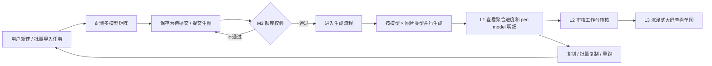

# AI 生图 · 多模型并行 PRD

> 配套：`index.html`（页面原型，UI / 视觉 / 交互细节落点）+ 各模型接口文档（LinkFox 已接，自研 / 阿里绘蛙由 PM 单独发送给后端）。
> 当前版本为 PRD 精简平衡版：以业务需求为主，保留必要技术建议和验收口径，不展开研发实现细节和测试用例明细。

---

## PRD 导读

### 文档定位

| 文档 | 用途 | 受众 |
| ---- | ---- | ---- |
| `README.md` | 产品需求文档 PRD，说明业务规则、范围、边界和验收关注点 | 产品 / 设计 / 研发 / 测试 / Leader |
| `index.html` | 页面原型，说明 UI、视觉和交互细节 | 产品 / 设计 / 研发 / 测试 |
| 各模型接口文档 | 各模型供应商接口字段和限制 | 后端研发 |

说明：

- 本 PRD 负责说清楚“要做什么、为什么做、规则是什么、边界怎么处理”。
- 页面原型负责说清楚“页面长什么样、交互怎么发生、各改动点落在哪里”。
- 研发和测试可基于本 PRD + 页面原型，自行生成技术方案、开发拆解、测试用例等衍生材料。
- 原独立 QA 测试建议不再单独维护，其精华已合入本文档的“验收关注点”和“兼容性要求”。

### 关键决策速览

| # | 决策 | 说明 |
| - | ---- | ---- |
| 1 | 三模型是协作“配方”关系 | 不是赛马，不是备份 |
| 2 | 新建默认仅 LinkFox 启用 | 启用其他模型时按后台上限自动填入默认值 |
| 3 | 复制 / 批量复制 / 重跑必须整条原样复制 | 包括启用模型、矩阵全部数值、LinkFox 专属字段 |
| 4 | 重跑 = 新增任务 | 旧任务数据不动，无版本号概念 |
| 5 | 启用但全 0 是“软关闭” | 编辑态保留；列表态隐藏 |
| 6 | `—` 和 `0` 严格区分 | `—` = 没东西可审；`0` = 审过但全没通过 |
| 7 | 标准普通 A+ 图当前仅 LinkFox 支持 | 自研 / 绘蛙默认上限为 0，未来可通过配置放开 |
| 8 | 配额回退文案只能用“返还”或“释放” | 禁止使用“免费” |
| 9 | phase 1 单 LinkFox 老任务不自动升级 | 筛 LinkFox 时仍需命中老任务 |
| 10 | 17 项改动以页面原型 S1-S17 为准 | 未列入 S1-S17 的内容不在本期范围 |

### 本期范围

- 三模型并行配置：LinkFox、自研、阿里绘蛙。
- 美工版：系统 SKU 维度，4 类图片。
- 运营版：店铺 ASIN 维度，5 类图片，含标准普通 A+ 图。
- L1 任务列表：新增、编辑、查看、筛选、配置列、进度列、结果列、全链路列。
- L2 审核工作台：分组头多模型微缩、卡片来源角标。
- L3 沉浸式大屏：顶部模型 Tag、LinkFox 专属字段适配。
- 复制、批量复制、重跑的数据完整性。
- phase 1 单 LinkFox 老任务兼容。

### 不在本期范围

- 模型自动推荐或自动分配张数。
- 多模型赛马、模型打分、模型效果排名。
- 新审核规则体系。
- 新增非 S1-S17 覆盖的页面能力。
- 研发内部数据库表结构、字段映射、任务调度实现细节。
- 测试用例明细和测试执行计划。

---

## 业务成功标准与前置条件

### 业务成功标准

本期上线后，需要达到以下业务结果：

| 维度 | 成功标准 |
| ---- | -------- |
| 新任务创建 | 用户可在美工版 / 运营版创建多模型任务，并按图片类型配置各模型计划张数 |
| 提交校验 | 提交前能按模型、图片类型、任务批次正确校验额度，不足时明确阻断并提示 |
| 任务执行 | 多模型任务可进入生成流程，列表层能看出整体进度和各模型明细 |
| 审核识别 | 审核人员在 L2 / L3 能清楚识别图片来源模型，避免把不同模型产出混在一起 |
| 配置复用 | 复制、批量复制、重跑时，启用模型、矩阵数值、LinkFox 专属字段完整保留 |
| 老任务兼容 | phase 1 单 LinkFox 老任务在新 UI 中可查看、编辑、复制、重跑、筛选，不被自动升级 |
| 展示口径 | `—`、`0`、全 0 模型、红警态等关键状态展示清晰，不误导用户判断任务结果 |

### 依赖与前置条件

| 依赖项 | 说明 | 责任方 / 来源 |
| ------ | ---- | ------------- |
| 页面原型 | `index.html` 是 UI、视觉、交互细节的主事实来源 | 产品 / 设计 |
| 后台额度配置 | 每个模型 × 图片类型的可用上限、是否可用，需要有后台配置来源 | 研发 / 运营配置 |
| 各模型接口文档 | LinkFox、自研、阿里绘蛙的接口字段、限制、错误码等不在 PRD 展开 | 后端研发 / PM 单独提供 |
| 历史任务数据 | phase 1 单 LinkFox 老任务需要作为兼容性验证样本 | 研发 / 测试 |
| 模型可用节奏 | 若三模型不能同时上线，需要明确不可用模型在前台的表现 | 产品 / 研发 |
| 文案口径 | 模型名称、额度提示、返还 / 释放等文案需要保持一致 | 产品 |

前置确认：

- LinkFox 仍是默认启用模型。
- 自研和阿里绘蛙是否对所有环境开放，需要在上线前确认。
- 运营版标准普通 A+ 图当前仅 LinkFox 可配，自研 / 阿里绘蛙默认不可配。
- M1 批量导入和 D1 新建任务的默认模型策略需要保持一致。

---

## 业务场景与流程补充

### 典型用户场景

| 场景 | 用户诉求 | 本期能力 |
| ---- | -------- | -------- |
| 运营为 ASIN 批量生成素材 | 希望同一个 ASIN 同时产出多类图片，并能分配给不同模型生成 | 运营版支持 5 类图片的多模型矩阵配置 |
| 美工为系统 SKU 准备商品图 | 希望按 SKU 配置场景图、特写图、卖点图等不同图片类型 | 美工版支持 4 类图片的多模型矩阵配置 |
| 审核人员对比不同模型产出 | 希望快速知道图片来自哪个模型，减少下钻排查成本 | L2 卡片角标、分组头微缩、L3 顶部模型 Tag |
| 运营查看任务执行质量 | 希望在列表层直接看到不同模型的成功、失败、审核情况 | L1 进度列、结果列、全链路列增加 per-model 明细 |
| 复用历史任务配置 | 希望复制或重跑时保留原任务的完整配置 | 复制 / 批量复制 / 重跑整条原样复制矩阵和 LinkFox 专属字段 |

### 端到端业务流程

### 术语与口径

| 术语 | 口径 |
| ---- | ---- |
| 模型 | LinkFox、自研、阿里绘蛙等图片生成供应方 |
| 图片类型 | 场景图、白底特写、特写图、卖点图、标准普通 A+ 图 |
| 多模型矩阵 | 横轴为模型、纵轴为图片类型的数量配置表 |
| cell | 矩阵中某模型 × 某图片类型的配置格 |
| 后台上限 / admin max | 后台配置的某模型某图片类型每日可用上限 |
| 计划张数 | 用户在矩阵中配置的计划生成张数 |
| 生成成功 | 模型已成功返回图片 |
| 生成失败 | 模型生成失败或该子任务失败 |
| 生成中 | 已提交但仍在生成中的图片 |
| 审核通过 | 生成图片在审核流程中通过 |
| 审核不通过 | 生成图片在审核流程中未通过 |
| 软关闭 | 用户启用某模型但所有 cell 均为 0；编辑态保留，列表态隐藏 |
| 红警态 | D2 编辑时，原任务存值超过当前后台上限，cell 标红并阻断保存 |
| phase 1 老任务 | 仅 LinkFox 的历史任务 |

### 典型配置样例

#### 样例 A：运营版多模型任务

| 图片类型 | LinkFox | 自研 | 阿里绘蛙 |
| -------- | ------: | ---: | -------: |
| 场景图 | 6 | 4 | 6 |
| 白底特写 | 4 | 2 | 0 |
| 特写图 | 2 | 2 | 0 |
| 卖点图 | 2 | 0 | 0 |
| 标准普通 A+ 图 | 8 | 0 | 0 |

展示预期：

- 总计划 = 34 张。
- pill 行展示 LinkFox、自研、阿里绘蛙。
- 标准普通 A+ 图仅 LinkFox 有值。
- 列表层 per-model 明细分别展示 3 个模型。

#### 样例 B：启用但全 0

| 图片类型 | LinkFox | 自研 | 阿里绘蛙 |
| -------- | ------: | ---: | -------: |
| 场景图 | 6 | 0 | 6 |
| 白底特写 | 4 | 0 | 0 |
| 特写图 | 2 | 0 | 0 |
| 卖点图 | 2 | 0 | 0 |
| 标准普通 A+ 图 | 8 | 0 | 0 |

展示预期：

- D1 / D2 编辑态：自研 pill 保留，用户能看到该模型已启用但全为 0。
- L1 列表态：自研 pill 和 per-model 行隐藏。
- 总计划不计入自研。

#### 样例 C：全链路 `—` 与 `0`

| 模型 | 计划 | 生成成功 | 审核通过 | 审核位 |
| ---- | ---: | -------: | -------: | ------ |
| LinkFox | 14 | 12 | 8 | `8` |
| 自研 | 8 | 0 | - | `—` |
| 阿里绘蛙 | 10 | 8 | 0 | `0` |

口径：

- 自研生成全失败，没有图片可审，审核位显示 `—`。
- 阿里绘蛙有图片进入审核，但全部未通过，审核位显示 `0`。

### 下游材料生成约束

研发、测试使用 AI 生成技术方案或测试用例时，以 `README.md` + `index.html` + 各模型接口文档为输入，并遵守以下约束：

- 不新增 PRD 和页面原型未覆盖的业务能力。
- 不把多模型理解为赛马、兜底或自动择优。
- 遇到开放问题时先标记待确认，不自行假设为已定稿规则。

---

## 1. 业务概念

### 1.1 三模型并行 = 协作"配方"关系

不是赛马，不是备份。三模型在同一任务中**并行产出**，每模型承担"配方"中各自的张数与图片类型。任务的最终交付 = 三模型产出的合集。

### 1.2 模型清单

| 名称       | code      | 缩写  | UI 颜色 |
| ---------- | --------- | ----- | ------- |
| LinkFox    | `linkfox` | LF    | 蓝      |
| 自研       | `self`    | 自研  | 绿      |
| 阿里绘蛙   | `huiwa`   | 绘蛙  | 橙      |

> **可扩展性**：未来可能加入豆包等模型。业务规则、后台配置和页面展示需为扩展预留（详见 7.2）。

### 1.3 涉及范围

- **美工版**（系统 SKU 维度）：4 类图片（场景图 / 白底特写 / 特写图 / 卖点图）
- **运营版**（店铺 ASIN 维度）：5 类图片（上述 4 类 + 标准普通 A+ 图）
- **L1 任务列表 / L2 审核工作台 / L3 沉浸式大屏**：均受影响

> "标准普通 A+ 图" 当前仅 LinkFox 支持，自研 / 绘蛙暂不支持，详见 3.4。

---

## 2. 技术实现建议（产品口径）

> 本章只保留会影响业务结果、兼容性和验收口径的技术建议，不替代研发技术方案。

### 2.1 模型接入原则

每个模型本质上都是“创建生成任务 + 查询生成结果”的异步链路。LinkFox 为 phase 1 已有链路，自研和阿里绘蛙为本期新增接入，具体接口字段以各模型接口文档和研发方案为准。

| 模型 | 本期要求 |
| ---- | -------- |
| LinkFox | 沿用已有能力，并补齐多模型矩阵、列表、审核、复制 / 重跑兼容 |
| 自研 | 接入多模型矩阵、生成进度、结果和审核来源展示 |
| 阿里绘蛙 | 接入多模型矩阵、生成进度、结果和审核来源展示 |

### 2.2 通用化建议

从产品长期扩展角度，建议研发尽量将“模型差异”收敛在接入层，业务层保持统一口径：

- 任务创建、额度校验、状态汇总、列表展示尽量复用同一套业务规则。
- 各模型外部字段差异由研发在技术方案中处理，PRD 不定义具体字段映射。
- 未来新增模型时，应尽量通过模型配置、额度配置和展示配置扩展，而不是重写一套业务流程。

### 2.3 任务与子任务口径

- 任务级状态仍保持主流程口径：待生成、生成中、已生成。
- 子任务粒度建议按“模型 × 图片类型”理解，用于支持各模型独立生成、失败隔离和进度汇总。
- 任一模型或图片类型失败，不应影响其他模型或图片类型继续生成。
- 列表层展示的总进度、成功数、失败数、审核数，需要由各模型子结果聚合得到。

### 2.4 额度机制

额度来源为后台对“模型 × 图片类型”的配置。PRD 只约定业务口径，不约定具体存储和接口字段。

| 场景 | 业务要求 |
| ---- | -------- |
| 新建默认 | 默认仅启用 LinkFox，数值按后台上限填充 |
| 启用新模型 | 按该模型当前后台上限填充默认值 |
| 提交任务 | 按本次提交任务累加校验额度，额度不足则阻断 |
| 生成失败 / 任务取消 | 已占用额度需要按失败或取消部分返还 / 释放 |
| 未配置额度 | 对应 cell 显示 `≤0`，不可输入 |
| 后台额度下调 | 历史任务原值不自动截断；D2 编辑时触发红警态 |

文案上统一使用“返还”或“释放”，不使用“免费”。

### 2.5 任务数据保留要求

任务需要能表达以下业务信息：

- 启用了哪些模型。
- 每个模型在每个图片类型上的计划张数。
- LinkFox 专属字段，包括生成图片语言、卖点图排版版式、A+ 图排版版式、该图对应卖点。

phase 1 老任务按“仅启用 LinkFox 的任务”兼容，不因本期多模型 UI 自动升级。

### 2.6 复制 / 重跑（对应 HTML S9）

复制、批量复制、重跑在业务上都等价于“基于原任务数据创建一条新任务”。重跑不是改写旧任务，也不引入版本号概念。

新任务必须完整继承原任务配置：

- 启用模型集合。
- 多模型矩阵全部数值。
- LinkFox 专属字段。

重点风险：phase 1 复制逻辑如果只复制 LinkFox 单模型字段，会导致多模型任务复制后数据残缺。本期需要把复制 / 批量复制 / 重跑统一纳入多模型完整性校验。

---

## 3. 页面与交互要求

> 页面视觉和布局以 `index.html` S1-S17 为准；本章只保留必须进入 PRD 的产品规则。

### 3.1 核心组件与任务操作

| 模块 | 产品规则 |
| ---- | -------- |
| 多模型矩阵 | 横轴为模型，纵轴为图片类型；启用模型时按后台上限填默认值；输入范围为 0 到后台上限；未配置额度时显示 `≤0` 且不可输入 |
| D1 新增 | 默认仅 LinkFox；启用其他模型后按后台上限填充；保存并提交进入 M3 额度校验 |
| D2 编辑 | 按任务原值回填；原值超过当前后台上限时进入红警态，不自动截断，保存 / 提交时阻断 |
| D3 查看 | 只读展示，仅渲染任务实际启用的模型列 |
| M1 批量导入 | 支持美工版 SKU / 运营版 ASIN；使用多模型矩阵；导入阶段只做基础校验，不做每日额度校验 |
| M2 批量修改 | cell 三态：留空 = 不修改，`0` = 改为 0，`>=1` = 改为指定张数；保留默认填充、全部清零、全部留空 |
| M3 提交确认 | 单条 / 批量提交前按模型校验额度；任一不足整体阻断；报错使用模型全名 |
| 复制 / 批量复制 / 重跑 | 基于原任务创建新任务，完整继承启用模型、矩阵数值和 LinkFox 专属字段 |

### 3.2 列表与审核展示

| 区域 | 产品规则 |
| ---- | -------- |
| 模型筛选 | 5 个 Tab 统一支持模型多选；多选为 OR；空选为全部；筛 LinkFox 需命中 phase 1 老任务 |
| 配置信息列 | 展示模型 pill、总计划和图片类型 breakdown；类型层不隐藏 0；模型层隐藏全 0；编辑态保留已启用模型 |
| 进度列 | 聚合展示计划、成功、生成中、失败；同时展示各模型明细 |
| 结果列 | 聚合展示成功 / 失败和耗时；同时展示各模型成功 / 失败明细 |
| 全链路列 | 展示计划、生成、审核链路；`—` 表示没东西可审，`0` 表示审过但全没通过 |
| L2 审核工作台 | 分组头和图片卡片均需识别模型来源 |
| L3 沉浸式大屏 | 顶部模型 Tag 随当前图片刷新；右栏保留 LinkFox 专属字段 |

### 3.3 LinkFox 专属能力

| 能力 | 产品规则 |
| ---- | -------- |
| 生成图片语言 | LinkFox 启用时显示 |
| 卖点图排版版式 | LinkFox 启用时显示；id 数量需与 LinkFox 卖点图数量一致 |
| A+ 图排版版式 | LinkFox 启用时显示；id 数量需与 LinkFox 标准普通 A+ 图数量一致 |
| 标准普通 A+ 图 | 当前仅 LinkFox 支持；自研 / 绘蛙通过后台上限为 0 控制不可输入 |
| L3 右栏字段 | 保留「该图对应卖点」「第三方 id」等 LinkFox 相关信息 |

---

## 4. 页面原型改动索引

| 范围 | 对应原型章节 | 关注点 |
| ---- | ------------ | ------ |
| 额度与任务配置 | S1-S5 | 顶部额度、D1 / D2 / D3、多模型矩阵、LinkFox 专属字段 |
| 批量与提交 | S6-S9 | M1 / M2 / M3、复制 / 批量复制 / 重跑 |
| 列表层 | S10-S14 | 模型筛选、配置列、进度列、结果列、全链路列 |
| 审核与大屏 | S15-S17 | L2 模型来源、L3 模型 Tag、LinkFox 右栏字段 |

---

## 5. 边界与异常

### 5.1 配额相关

| 场景                       | 处理                                                     |
| -------------------------- | -------------------------------------------------------- |
| 模型未在 admin 配置        | `max = 0`，cell 不可输入                                 |
| 配额不足                   | M3 提交时阻断                                            |
| 任务失败 / 取消            | 配额返还（用词「返还」或「释放」，禁止「免费」）         |
| admin 配额改小后原任务超 max | D2 编辑抽屉红警特殊态，提交时阻断                        |

### 5.2 多模型相关

| 场景                                | 处理                                                            |
| ----------------------------------- | --------------------------------------------------------------- |
| 用户启用某模型但全填 0（"软关闭"） | 列表 pill 行隐藏该模型；D1/D2 编辑态保留                       |
| phase 1 单 LinkFox 老任务在新 UI    | 列表 pill 行只显示 LinkFox 一个 chip / per-model 行只显示一行 |
| 复制 phase 1 老任务                 | 保持单 LinkFox（不自动升级为多模型）                           |
| 筛选老任务                          | 自动归类「含 LinkFox」                                          |

### 5.3 部分失败

| 场景                       | 处理                                                              |
| -------------------------- | ----------------------------------------------------------------- |
| 某模型某图片类型生成失败   | 不影响其他子任务                                                  |
| Tab2 进度列                | 失败数 +1，per-model 行 ✗N 高亮                                   |
| Tab3 结果列                | 失败数 +1，per-model 行 ✗N 高亮                                   |
| Tab4/5 全链路 · 生成全失败 | 该模型审核位显示 `—`（与 `0` = 审过全没通过 严格区分）            |

### 5.4 文案规范

| 场景             | 规范                                                  |
| ---------------- | ----------------------------------------------------- |
| 报错 / 提示      | 使用**模型全名**（"LinkFox" 不是 "LF"）               |
| 配额返还描述     | 用「返还」或「释放」，**禁止「免费」**                |
| 表格 / 微缩条    | 用缩写（LF / 自研 / 绘蛙），节省空间                  |
| 模型 chip 配色   | LinkFox 蓝 / 自研 绿 / 阿里绘蛙 橙（详见页面原型） |

---

## 6. 阶段交付

本期范围以第 4 章所列 S1-S17 页面原型范围为准；未覆盖内容不在本期。

---

## 7. 附录

### 7.1 外部资料与技术对接说明

| 资料 | 用途 |
| ---- | ---- |
| LinkFox 既有文档 / 代码 | 作为 phase 1 兼容和既有字段能力的参考 |
| 自研接口文档 | 作为研发接入自研模型的技术依据 |
| 阿里绘蛙接口文档 | 作为研发接入绘蛙模型的技术依据 |

PRD 不展开各模型接口参数、返回值、错误码、数据库字段和任务调度细节。研发可基于本文业务规则、页面原型和接口文档自行形成技术方案；如供应商限制影响业务表现，需要反向同步到 PRD 或开放问题中。

### 7.2 模型扩展建议（未来加新模型，如豆包）

未来新增模型时，建议优先沿用本期“模型 × 图片类型”的矩阵口径，并从以下维度评估：

- 后台是否能配置该模型各图片类型的可用上限。
- D1 / D2 / D3 / M1 / M2 / M3 是否能复用同一套矩阵交互。
- L1 / L2 / L3 是否能展示模型来源、进度、结果和审核口径。
- 复制、重跑、老任务兼容是否仍能保持完整。

---

## 8. 验收关注点

> 本章节只圈定产品验收重点，不替代测试团队的测试用例、测试计划和执行明细。

### 8.1 验收准备

验收前建议至少准备：

1. 后台已配置三模型（LinkFox / 自研 / 阿里绘蛙）× 各图片类型上限。
2. 测试账号在美工版和运营版均有可操作数据。
3. 至少 1 条 phase 1 单 LinkFox 老任务，用于兼容性对比。
4. 至少 1 个未在后台配置过额度的模型或图片类型场景，用于验证 `≤0` 和不可输入。

### 8.2 主流程验收重点

| 模块 | 验收重点 |
| ---- | -------- |
| D1 新增任务 | 默认仅 LinkFox；启用其他模型后按后台上限填默认值；保存并提交进入额度校验 |
| D2 编辑任务 | 矩阵和 LinkFox 专属字段正确回填；修改后可保存；取消不改原数据 |
| D3 查看任务 | 只读展示；只渲染任务实际启用模型；未启用模型不显示 |
| M1 批量导入 | 美工版 / 运营版均可导入；默认矩阵正确；导入阶段不做每日额度校验 |
| M2 批量修改 | 留空 = 不修改；`0` = 改为 0；`>=1` = 改为指定张数 |
| M3 提交确认 | 单条 / 批量提交均需按模型额度校验；额度不足时阻断并明确指出不足模型 |
| 复制 / 批量复制 / 重跑 | 启用模型、矩阵数值、LinkFox 专属字段完整继承；旧任务数据不被改写 |

### 8.3 列表与审核验收重点

| 区域 | 验收重点 |
| ---- | -------- |
| Tab 1-5 模型筛选 | 不选模型显示全部；单选 / 多选命中启用对应模型的任务；筛 LinkFox 命中 phase 1 老任务 |
| Tab 1/2/3 配置信息列 | pill 行、总计划、类型 breakdown 正确；类型层不隐藏 0；模型层隐藏全 0 |
| Tab 2 生成进度列 | 聚合进度正确；per-model 成功 / 生成中 / 失败明细正确 |
| Tab 3 生成结果概览列 | 可区分整体成功失败与各模型成功失败 |
| Tab 4/5 全链路列 | `—` 表示没东西可审；`0` 表示审过但全没通过；二者必须严格区分 |
| L2 审核工作台 | 分组头和图片卡片能识别模型来源 |
| L3 沉浸式大屏 | 顶部模型 Tag 与当前图片来源一致；LinkFox 专属字段展示正常 |

### 8.4 关键边界验收重点

关键边界以第 5 章为准，验收时重点覆盖：

- 额度不足、未配置额度、后台额度下调后的红警态。
- 启用但全 0、`—` vs `0`、部分模型失败。
- 复制 / 批量复制 / 重跑、phase 1 老任务、标准普通 A+ 图。

### 8.5 覆盖建议

- 美工版和运营版均需覆盖主流程；运营版额外关注标准普通 A+ 图。
- L1 / L2 / L3 均需覆盖模型来源、进度、结果、审核口径。
- phase 1 老任务需覆盖查看、编辑、复制、重跑、LinkFox 筛选。
- 文案重点关注模型全名、额度不足、返还 / 释放、红警态提示。

---

## 9. 兼容性要求

### 9.1 phase 1 单 LinkFox 老任务在新 UI 各处的显示

| 位置 | 期望显示 |
| ---- | -------- |
| L1 列表 Tab 1/2/3 配置列 | pill 行只显示 LinkFox 一个 chip |
| L1 列表 Tab 2 进度列 | per-model 明细行只有 LinkFox 一行 |
| L1 列表 Tab 3 结果列 | per-model 明细行只有 LinkFox 一行 |
| L1 列表 Tab 4/5 链路列 | per-model 明细行只有 LinkFox 一行 |
| L2 审核工作台 | 分组头微缩 / 卡片角标只显示 LinkFox 单色 |
| L3 沉浸式大屏 | 顶部 Tag 为 LinkFox，右栏字段正常 |

### 9.2 phase 1 老任务常规操作

- D2 编辑：可正常打开、修改、保存。
- D3 查看：可正常打开。
- 复制：保持单 LinkFox。
- 重跑：基于老任务创建新任务，仍保持单 LinkFox。
- 筛选 `[模型 ▾]` 选择 LinkFox：命中所有老任务。

### 9.3 接口分批上线中间态

如果技术上线节奏导致模型分批可用，需要明确以下业务表现：

- 自研可用但阿里绘蛙暂不可用时，D1 是否允许启用绘蛙。
- 不可用模型应隐藏、禁用，还是展示并提示。
- 三模型分别灰度时，列表层统计聚合是否仍按实际可用模型正确计算。

---

## 10. 风险与上线关注点

### 10.1 主要业务风险

| 风险 | 可能影响 | PRD 要求 |
| ---- | -------- | -------- |
| 复制 / 重跑只复制部分配置 | 用户复用历史任务后，模型配置或 LinkFox 专属字段丢失 | 必须整条原样复制，不允许只复制主任务基础信息 |
| 全 0 模型和未启用模型混淆 | 用户误以为模型参与了生成，或误以为配置丢失 | 编辑态保留全 0 模型；列表态隐藏全 0 模型；未启用模型不展示 |
| `—` 和 `0` 展示混淆 | 审核结果判断错误，影响任务质量分析 | `—` 只表示没东西可审；`0` 表示审过但全没通过 |
| 后台额度下调后直接改写历史任务 | 历史任务配置被动变化，用户难以解释 | D2 触发红警态，列表层不自动改写任务存值 |
| M1 与 D1 默认模型策略不一致 | 批量导入和手工新建产生不同业务结果 | 默认策略需要统一，当前建议默认仅 LinkFox |
| 模型 code / 名称不一致 | 筛选、列表、审核来源展示出现错配 | 前台展示统一使用模型全名；内部 code 以研发方案统一 |
| 模型分批上线但前台仍可提交 | 用户提交到不可用模型，造成失败或额度误占 | 不可用模型至少需要禁用并明确提示 |
| phase 1 老任务被自动升级 | 老任务表现变化，影响历史数据解释 | 老任务保持单 LinkFox，不因新 UI 自动补齐其他模型 |

### 10.2 上线与灰度关注点

上线或灰度期间，需要优先确认以下业务表现：

- 三模型不能同时上线时，不可用模型应隐藏或禁用，不能让用户误提交。
- 若只灰度部分用户或部分环境，列表、详情、审核工作台需要对同一任务保持一致展示。
- 老任务入口必须先验证：查看、编辑、复制、重跑、筛选 LinkFox。
- 额度配置变更需要可被前台及时感知；若存在缓存或延迟，需要有明确提示或刷新策略。
- 本期不要求新增模型效果排名、模型推荐、自动择优等能力，灰度期间也不应临时引入。

### 10.3 回滚关注点

如果上线后需要回滚，业务上至少需要保证：

- LinkFox 单模型创建 / 提交 / 查看链路可恢复。
- 已创建的多模型任务数据不能被删除或自动改写。
- 老任务在回滚前后仍能查看和筛选。
- 回滚期间如暂时不能继续编辑多模型任务，需要给出明确提示，而不是静默失败。
- 已占用或已释放的额度口径需要保持可追溯，避免用户看到前后不一致的额度结果。

---

## 11. 开放问题 / 待确认

以下问题建议在 PRD 评审或研发方案前确认：

| # | 问题 | 当前建议 |
| - | ---- | -------- |
| 1 | M1 批量导入默认启用模型是否与 D1 完全一致 | 建议统一为默认仅 LinkFox |
| 2 | 自研模型 code 是否统一使用 `self` | PRD 中以 `self` 为准；页面原型 demo 若使用其他变量名，后续可单独校准 |
| 3 | 模型分批上线时，不可用模型的前台表现 | 建议至少禁用并给出明确提示，避免用户误提交 |
| 4 | 标准普通 A+ 图未来放开后，是否所有模型沿用同一图片类型名称 | 建议沿用同一图片类型，通过后台上限控制可用性 |
| 5 | “第三方 id”在自研图片 id 缺失期间如何展示 | 建议先展示任务 id，并备注当前图片 id 暂缺 |

---

## 12. 版本记录

| 版本 | 说明 |
| ---- | ---- |
| v1.0 | 原 `ai_image_multimodels_spec.md` 原文迁移为 `README.md` |
| v1.1 | 增加 PRD 导读、范围、不在范围、验收关注点、兼容性要求、开放问题 |
| v1.2 | 增加业务场景、端到端流程、术语口径、典型配置样例、衍生材料生成建议 |
| v1.3 | 增加业务成功标准、依赖与前置条件、风险与上线 / 灰度 / 回滚关注点 |
| v1.4 | 压缩过深技术细节和测试步骤，调整为 PRD 平衡版 |
| v1.5 | 第二轮精简，压缩重复说明和过细页面 / 验收描述 |
| v1.6 | 第三轮精简，合并页面规则和原型改动索引 |

---

**文档版本**：v1.6

**关联文件**：`index.html`（页面原型）+ 各模型接口文档（独立发送）

**更新时间**：2026-05-27
